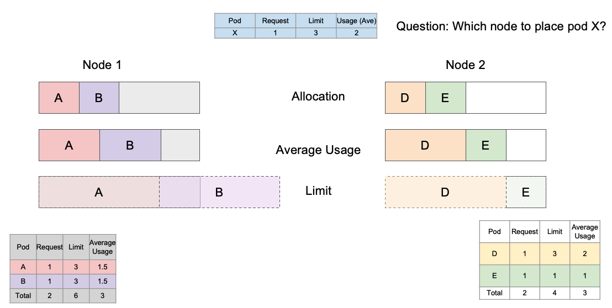
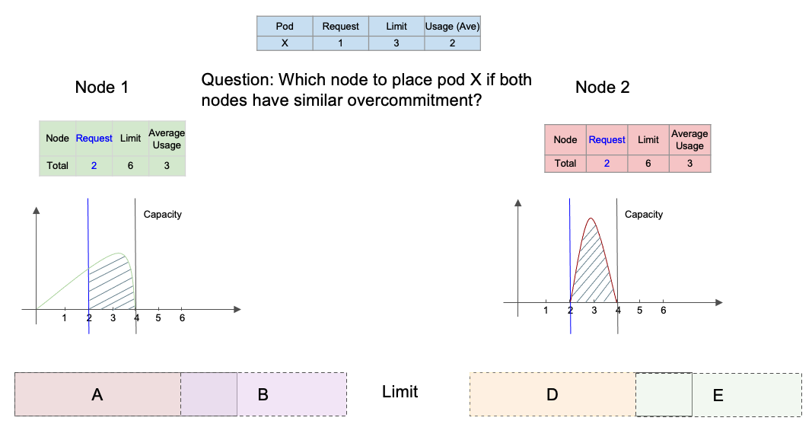
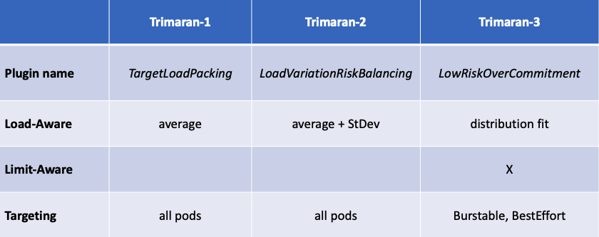
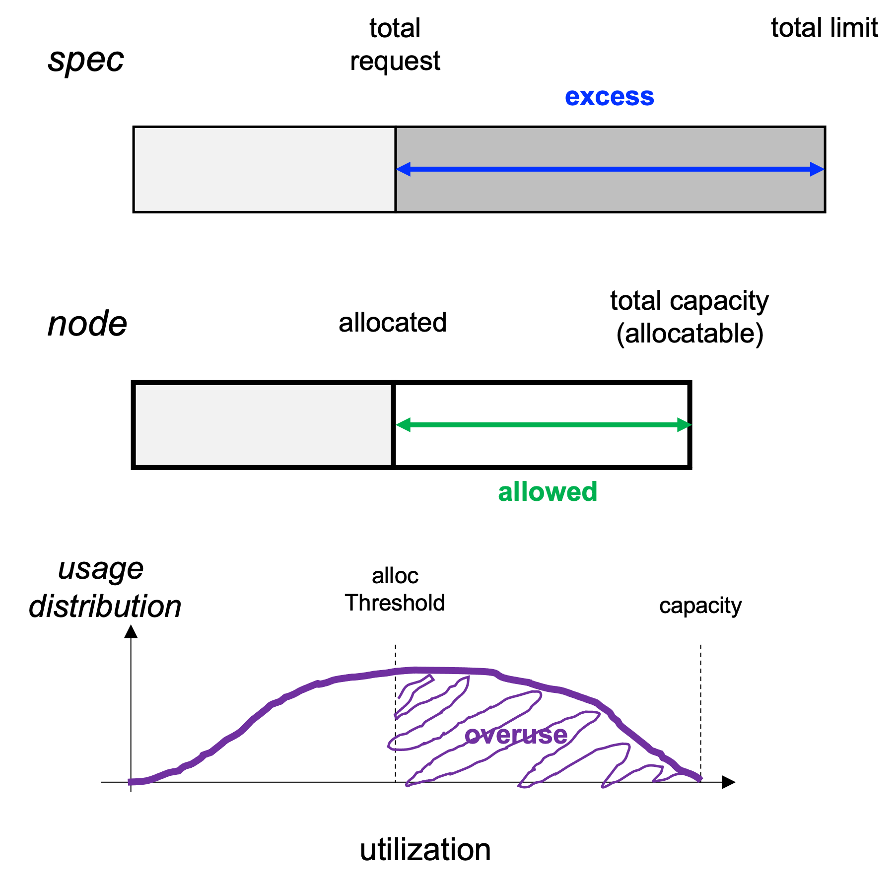
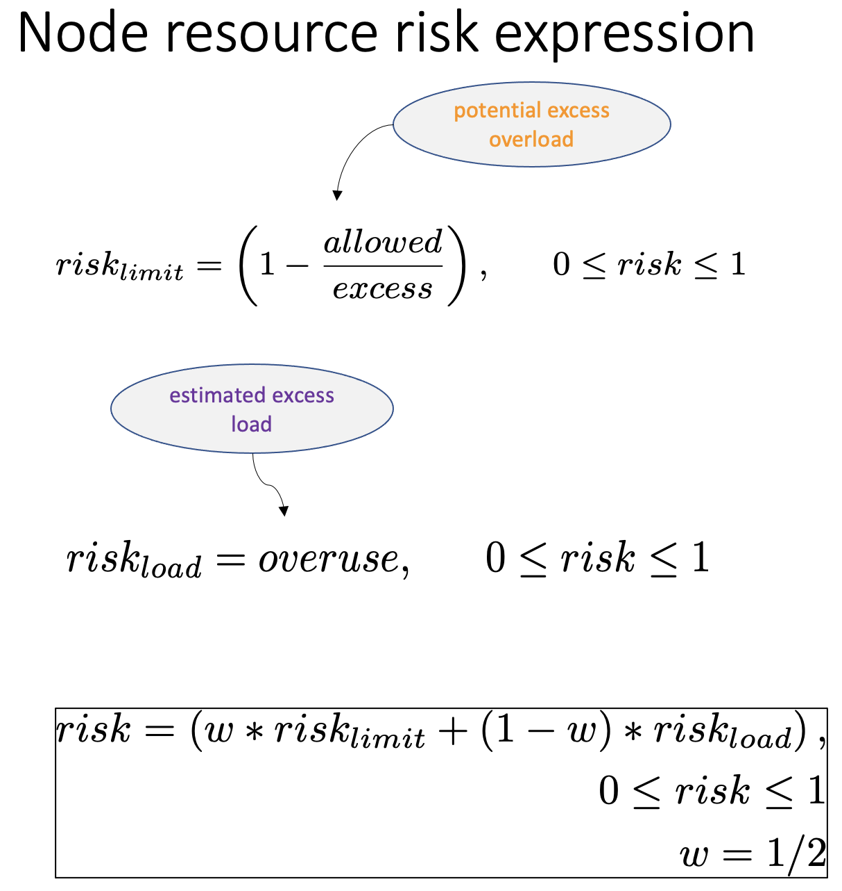

# KEP-357: Overcommitment aware scheduler

## Summary

Though containers are allowed to specify resource limit values beyond the requested (guaranteed) values, most schedulers are only concerned with the requested values. This may result in a cluster where some (or all) nodes are overcommitted, thus leading to potential CPU congestion and performance degradation and/or memory OOM situations and pod evictions. A scheduler which takes into consideration (1) the resource limit values of pods (limit-aware) and (2) the actual load (utilization) on the nodes (load-aware) could provide a low risk environment for pods and alleviate issues with overcommitment, while allowing pods to use their limits.

## Motivation

Burstable and best effort pods are implicitly declaring that they may be, intermittently or continuously, using resources up to their limits. For a scheduler not to consider those limit values, and rely only on requested values, may lead to overcommitment of some nodes, thus affecting the performance of pods running on such nodes through competition and congestion, or even total evictions. A simplistic scheduler which utilizes limits, instead of requests, results in an under-utilized cluster and wasted resources. This proposal describes a scheduler (score) plugin which evaluates the performance risk of overcommitment and selects the node with lowest risk. It achieves this goal by combining two risk factors: limit risk and load risk. The limit risk is based on requests and limits values. And, the load risk is based on observed load. Thus, the proposed scheduler is risk-aware as well as load-aware. The outcome is that burstable and best effort pods are placed on nodes where the chance of being impacted by overcommitment is minimized, while providing them a chance to burst up to their full limits.

### Goals

Specifically, the goals of the proposed scheduler plugin is to

- manage over-commitment based on load,
- lower potential CPU congestion and performance degradation,
- lower the chance of OOM and pod eviction,
- give room for pod usage to burst within its limit, and
- put load on under-commited and/or under-utilized nodes.

### Non-Goals

Since the proposed scheduler plugin is concerned with overcommitment, minimizing the risk for guaranteed pods is not applicable, as the risk is zero.

## Proposal

The proposal is to provide a scheduler plugin which is:

- Limit-aware: calculates the potential excess overload due to the allowed range between request and limit values
- Load-aware: estimates the risk of excess overload based on load metrics

### User Stories

We provide two user stories, the first is a demonstration of limit-awareness, and the second demonstrates both limit and load awareness.

#### Story 1

Consider clusters with many `burstable` workloads, where  containers have their limits much greater than their requests.



- For such clusters, schedulers should not only consider resource allocation (via requests) but also consider how likely their allowed peak usage (via limits) will exceed the capacity.
- The proposed scheduler calculates a `limit-risk`, thus providing room for containers to burst.
- [Detailed description and results](story-1.md)

#### Story 2

Consider clusters where we have a lot of `burstable` workloads with varying usage levels.



- For such clusters, it is desirable to consider not only the allowed peak usage but also the actual distribution of the usage.

- This is an advanced scenario over the first one, where we consider both `limits` and the actual `usage`.
- The proposed scheduler calculates `limit-risk` and `load-risk`,  thus providing room for containers to burst, lowering the chance of competing with other bursting containers on the same node.
- [Detailed description and results](story-2.md)

### Notes/Constraints/Caveats

Since the proposed scheduler plugin is load-aware and uses the [load-watcher](https://github.com/paypal/load-watcher), similar to the [Trimaran](https://github.com/kubernetes-sigs/scheduler-plugins/tree/master/pkg/trimaran) family of plugins, the suggestion is to add it to the family as *Trimaran-3* for short. The proposed name for the plugin is *LoadRiskAwareCommitment*. This way it could share common code with the other two plugins. A comparison of the three Trimaran load-aware scheduler plugins follow.



### Risks and Mitigations

If utilization metrics are not available for a long time, the scheduler will be limit-aware, achieving its partial goal. For more details on risks and mitigations regarding bad metrics refer to [kep-trimaran](https://github.com/kubernetes-sigs/scheduler-plugins/tree/master/kep/61-Trimaran-real-load-aware-scheduling).

## Design Details

The proposed scheduler is a *Score* plugin which calculates a node score using the three main quantities depicted in the diagram below.



- **Excess**: The difference between the total limit and total request of all pods allocated on a node (including the pending pod, subject of scheduling). Using a limit of zero for best effort pods, if the total limit is below the node capacity (allocatable), then the total limit is set to the capacity in case there is one or more best effort pods. Excess is always non-negative.
- **Allowed**: The difference between the minimum of the total limit and the node capacity, and total request. In other words, it is the room for load to go beyond the guaranteed allocated (total request) value on the node.  Allowed is always less or equal to Excess.
- **Overuse**: The probability that load (utilization) is above the allocated value (total request). It is the area under the probability density function of utilization beyond total request. The distribution function is that of a Beta distribution, fitted to match the average and standard deviation metrics provided by the load-watcher.

The risk calculation as summarized in the diagram below.



Basically, there are two risk factors. The value of each factor is a fraction between 0 and 1, representing lowest and highest risks, respectively.

- **limit risk**: measures the potential for excess load and calculated as (1 - allowed/excess).
- **load risk**: estimates the load (utilization) amount due to the excess and calculated as the overuse.

Total risk, or simply risk, is a weighted sum of the limit risk and load risk. The weight is a parameter with a default value of 0.5.

The risk is calculated for the resources under consideration, namely CPU and memory. Then, the nodeRisk is taken as the highest of the two resource risks. The node score is then evaluated as: 100 * ( 1 - nodeRisk).

To summarize, the steps for calculating the node score are as follows.

- Calculate limit risk factor

  - get node total request and total limit
  - add (new) pod request and limit
  - evaluate potential excess

- Calculate load risk factor

  - collect average and standard deviation from load watcher
  - fit a (beta) distribution for utilization
  - calculate tail of distribution, beyond allocated
  - evaluate competition in excess

- Calculate total risk factor

  - weighted sum of limit and load factors
  - evaluate across resources; pick worse
  - provide a node score

### Plugin Config Args

There are two parameters for the proposed plugin, in addition to the parameters common to all Trimaran plugins:

- *SmoothingWindowSize*: Since data collected by the metric provider, e.g. Prometheus, is typically smoothed over a number of data points, the reported standard deviation metric is less than its realistic value by a factor equal to the squared root of the number of points in the smoothing window. The default value for the window size is 5. Correction due to smoothing is calculated by the plugin.
- *RiskLimitWeight*: As mentioned earlier, total risk is a weighted sum of limit rist and load risk. The weight which multiplies the limit risk is the RiskLimitWeight. The weight of the load risk is then (1 - RiskLimitWeight). The default value is 0.5, i.e. equally weighted.

```go
// LoadRiskAwareCommitmentArgs holds arguments used to configure LoadRiskAwareCommitment plugin.
type LoadRiskAwareCommitmentArgs struct {
 TrimaranArgs

 // Smoothing window size for usage data in the load watcher
 SmoothingWindowSize int64
 // Weight of risk due to limits (fraction)
 RiskLimitWeight float64
}

// TrimaranArgs hold common arguments for trimaran plugins
type TrimaranArgs struct {
 metav1.TypeMeta

 // Metric Provider to use when using load watcher as a library
 MetricProvider MetricProviderSpec
 // Address of load watcher service
 WatcherAddress string
}

// Denote the spec of the metric provider
type MetricProviderSpec struct {
 // Types of the metric provider
 Type MetricProviderType
 // The address of the metric provider
 Address string
 // The authentication token of the metric provider
 Token string
}

// MetricProviderType is a "string" type.
type MetricProviderType string

const (
 KubernetesMetricsServer MetricProviderType = "KubernetesMetricsServer"
 Prometheus              MetricProviderType = "Prometheus"
 SignalFx                MetricProviderType = "SignalFx"
)
```

### Plugin Config Map

```yaml
apiVersion: v1
kind: ConfigMap
metadata:
  name: trimaran-scheduler-config
  namespace: trimaran
data:
  config.yaml: |
    apiVersion: kubescheduler.config.k8s.io/v1beta2
    kind: KubeSchedulerConfiguration
    leaderElection:
      leaderElect: false
    profiles:
    - schedulerName: trimaran
      plugins:
        score:
          enabled:
          - name: LoadRiskAwareCommitment
            weight: 10
          disabled:
          - name: '*'
      pluginConfig:
      - name: LoadRiskAwareCommitment
        args:
          metricProvider:
            type: Prometheus
            address: http://prometheus-k8s.monitoring.svc.cluster.local:9090
          smoothingWindowSize: 5
          riskLimitWeight: 0.5
```

### Plugin Deployment

```yaml
apiVersion: apps/v1
kind: Deployment
metadata:
  name: trimaran
  namespace: trimaran
spec:
  replicas: 1
  selector:
    matchLabels:
      component: scheduler
      tier: control-plane
  template:
    metadata:
      labels:
        component: scheduler
        tier: control-plane
    spec:
      volumes:
        - name: etckubernetes
          configMap:
            name: trimaran-scheduler-config
      containers:
        - name: kube-scheduler
          image: trimaran3:1.0
          imagePullPolicy: IfNotPresent
          command:
          - /bin/kube-scheduler
          - --config=/etc/kubernetes/config.yaml
          - -v=6
          volumeMounts:
          - name: etckubernetes
            mountPath: /etc/kubernetes
          securityContext:
            privileged: true
      hostNetwork: false
      hostPID: false

```

### Test Plan

Unit tests and Integration tests will be added.

## Production Readiness Review Questionnaire

### Dependencies

Metric providers such as Prometheus, Kubernetes Metrics Server, and Signal FX.

### Scalability

- Will enabling / using this feature result in any new API calls?

  No.

- Will enabling / using this feature result in introducing new API types?

  No.

- Will enabling / using this feature result in any new calls to the cloud provider?

  No.

- Will enabling / using this feature result in increasing size or count of the existing API objects?

  No.

- Will enabling / using this feature result in increasing time taken by any operations covered by [existing SLIs/SLOs](https://git.k8s.io/community/sig-scalability/slos/slos.md#kubernetes-slisslos)?

  No, to be confirmed with some benchmarking.

- Will enabling / using this feature result in non-negligible increase of resource usage (CPU, RAM, disk, IO, ...) in any components?

  No, the utilization distribution fitting involves only algebraic equations, no systems of equations to solve.

### Troubleshooting

- How does this feature react if the API server and/or etcd is unavailable?

  Running pods are not affected. Any new submissions would be rejected by scheduler.

- What are other known failure modes?

  N/A

- What steps should be taken if SLOs are not being met to determine the problem?

  N/A

## Implementation History

## Drawbacks

## Alternatives
