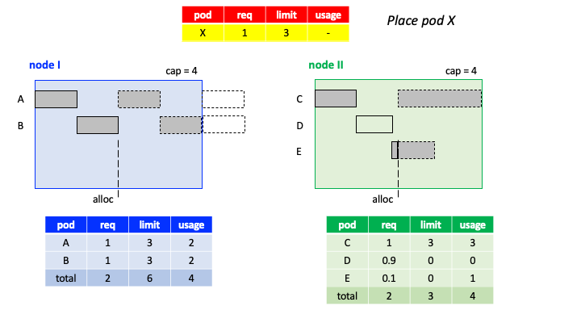
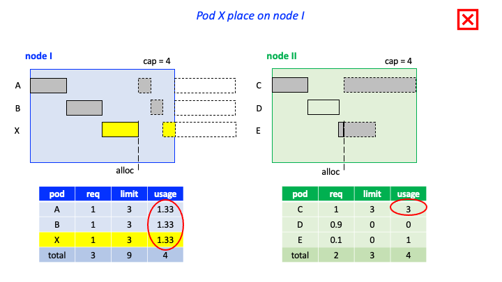
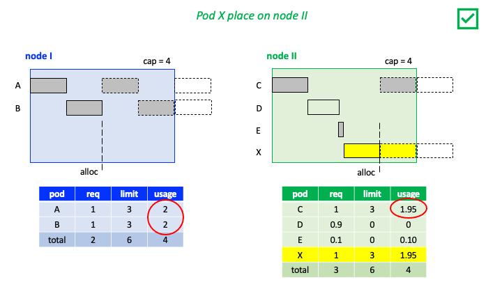
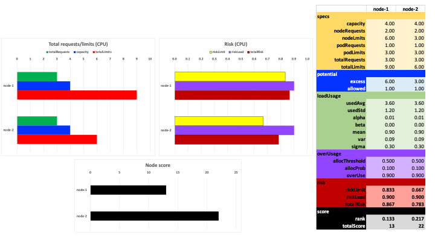

# Story 1

Consider a cluster with two nodes, I and II, and a single resource (CPU). Both nodes have a capacity (allocatable) of 4 cores. The state of the cluster is described below. Pods A and B are placed on node I, and pods C, D, and E are placed on node II. Pods A, B, and C are similar in their specifications and behavior. They have a request of 1 core and a limit of 3 cores. They run a workload that is CPU-intensive, thus will use all 3 cores, if allowed. Pod D is a best-effort pod with a request of 0.9 cores and is mostly idle. And, pod E is a best-effort pod with a request of 0.1, but with a heavy load. Both nodes have the same total requests, hence equally likely to be selected by a default scheduler.

Assume a pending pod X, similar to pods A, B, and C, needs to be scheduled.

If pod X is placed on node I, then pods A, B, and X will share the 4 cores equally, hence each gets 1.33 cores, as depicted below. Pod C will continue to use 3 cores on node II, and the best-effort pod E will continue to use the remaining 1 core, well beyond its requested 0.1 cores.

On the other hand, if pod X is placed on node II, then the CFS scheduler will divide the 4 cores among pods C, D, E, and X based on their request values. Pod D does not have a significant load, so sharing happens among pods C, E, and X. Since pods C and X have a relatively high requests, then pod E will get mainly its requested guarantee and pods C and X will share the rest, getting about 1.95 cores each. The placement of pod X on node II results in less risk of overcommitment and a higher usage, comparable to similar pods, A, B, and C.

Below is the actual calculations due to the proposed scheduler plugin. The expression for the two risk factors: limit risk and load risk, as well as the overall risk and node scores are provided in the design details section. The total score for nodes I and II are 13 and 22, respectively, thus pod X is scheduled on node II.

