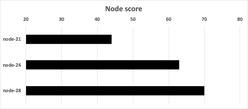

# Story 2

This scenario is based on a real cluster of 3 nodes (node-21, node-24, and node-28) and a background injected load using a stress tool. (Here, for simplicity, we are concerned with the CPU resource, as memory was not stressed.) The node capacity (allocatable) is 3,910 millicores. The pending pod to be scheduled is a best-effort pod with a request of 100 millicores. The total node requests (allocation) and limits (including the pending pod) are shown in the table below. Node-28 had a much higher allocation of 3,568 millicores, compared to 2,617 and 2,544 millicores, for node-21 and node-24, respectively. All nodes were overcommitted, with node-21 being highest in overcommitment (5,816 millicores).

The actual load was measured through the [load-watcher](https://github.com/paypal/load-watcher), collecting data from Prometheus, and providing average and standard deviation metrics for all nodes. (Data is smoothed over a window of 5 data points.) The proposed scheduler plugin uses the average and standard deviation values to fit a [Beta distribution](https://en.wikipedia.org/wiki/Beta_distribution) as an approximation to the load distribution, which has two parameters: alpha and beta. Measured data (usedAvg and usedStd) as well as the fitted parameters (alpha and beta) are provided in the table below. The quantities: mean, var(iance), and sigma (standard deviation) are for the fitted distribution with units of node capacity. Note that the average load was high (63%) for node-21, medium (49%) for node-22, and low (34%) for node-28.  The standard deviation, which is a measure of the variation in the load over time, was 27%, 35%, and 24%, for the 3 nodes, respectively. Based on the risk expressions provided in the design details section, the total score for the nodes were 44, 63, and 70 for the 3 nodes, respectively. Therefore, node-28 was selected. Even though node-28 had a high limit risk (0.579), as the allocated (requests) was 3,568 millicores which is close to the limit of 4,380, but the load risk was low  (0.016) due to the light load on the node beyond the allocated amount. The combined total risk for the node, which is a weighted sum of the limit and load factors, was 0.297, the lowest among all 3 nodes in the cluster.

The values of total requests and limits for the 3 nodes are shown below.

The corresponding values of the limit risks are shown below.

The fitted Beta distribution for the 3 nodes are depicted below. The vertical (green) lines correspond to the total node requests (allocated). The area under the curve beyond those lines is a measure of estimated overuse.

The corresponding values of the load risks (amount if overuse) are shown below.

The combined total risk for the nodes, which is a weighted sum of the limit and load factors, using a weight of 0.5, are shown below.

The node score linearly increases as the total risk decreases with the best value at 100. The node scores for the cluster are shown below. The proposed scheduler (abbreviated trimaran-3) selected node-28, whereas the default would have selected node-21.

